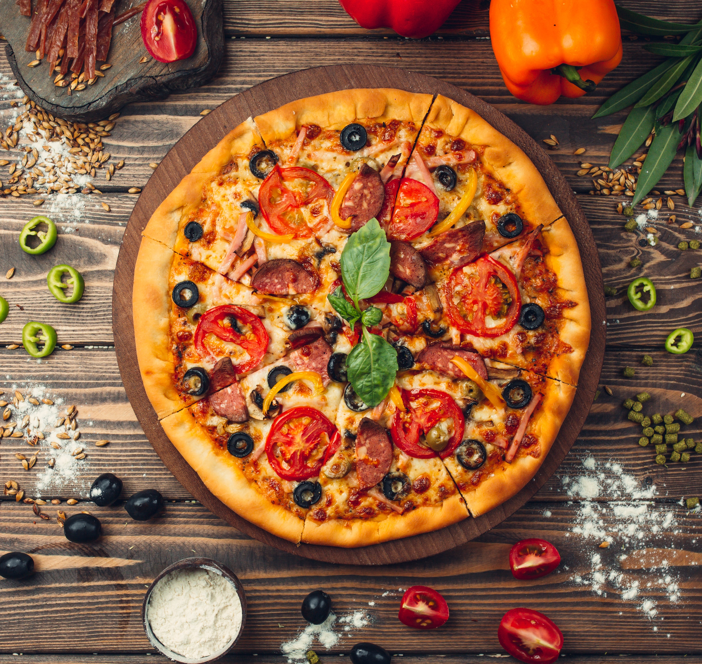
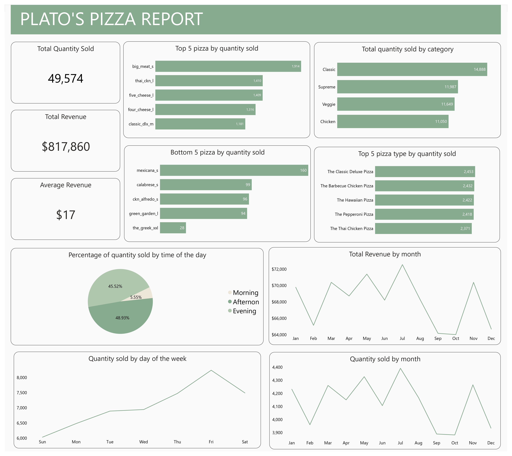

# Plato's Pizza Analysis

## Introduction
I've been hired as a BI consultant by Plato’s Pizza to help the restaurant use data to improve operations. Things are going OK here at Plato's, but there's room for improvement. They've been collecting transactional data for the past year, but really haven't been able to put it to good use. Plato’s pizza is  hoping I can analyse the data and put together a report to help find opportunities to drive more sales and work more efficiently.

## Problem Statement
Some of the questions this analysis and report aim to answer includes;
1. Show a clear up-to-date KPI
2. What trends, patterns, or seasonality can be identified? Are there particular months where we excel, and others where we need improvement?
3. What days and times do we tend to be busiest?
4. What are our best and worst selling pizzas?

## Skills Demonstrated
- Data Analysis Expression(DAX): Measures, Calculated Columns
- Data cleaning and exploration with Power Query
- Time intelligence analysis

## Data Sourcing

The dataset was downloaded from Maven Analytics Website. This dataset contains 4 tables in CSV format
- The Orders table contains the date & time that all table orders were placed
- The Order Details table contains the different pizzas served with each order in the Orders table, and their quantities
- The Pizzas table contains the size and price for each distinct pizza in the Order Details table, as well as its broader pizza type
- The Pizza Types table contains details on the pizza types in the Pizzas table, including their name as it appears on the menu, the category it falls under, and its list of ingredients

## Data Transformation and Cleaning

Data cleaning and transformation was efficiently done with the power query editor of powerbi. Some steps applied include;
- Checking for missing data and inconsistences in categorical data, which there was none.
- Promoted first row to headers in the **pizza type** table
- To create a connection between the **order details** table and **pizza type** tables, I merged **order details** and **pizzas** table and retained pizza type id column.
- In order to calculate revenue, I also retained the price column from the **pizzas** table, multiplied price and quantity in a new column to obtain revenue.

.png)

## Data Modelling

PowerBI automatically connected related tables resulting in a star schema with the **Order details** table being the fact table and **orders**, **pizzas** and **pizza types**, the dimensions table. I also created the date table to enable time intelligence analysis. 

The automatically generated relationships were adjusted to remove unwanted relationships.

Auto model    |    Adjusted Model
:------------:|:-----------------:
.png)|.png)

## Analysis and Visualisations

I created measures for total quantity sold, total revenue and average revenue and carried out other analysis displayed in the report below. View DAX code [here](Plato'spizzaDAX.txt)

You can interact with the report [here](https://app.powerbi.com/groups/me/reports/80345dfa-b84d-4394-b514-a876b2ed51fd/ReportSectionc5264703a15260ad86da?experience=power-bi)

## Insights ✨

- A total of 49,574 pizzas were sold and $817,860 made in revenue
- Plato’s pizza recorded the most pizza sales and made the most revenue in the month of July
- Most orders were gotten on Friday
- We made major sales in the afternoon
- The best selling pizza is the big_meat_s (The Gid Meat Piza, size small)
- The worst selling pizza is the_greek_xxl(The Greek Pizza, size XXL)
- Pizzas in the classic category are ordered the most

## Conclusions and Recommendations

- Sales made on other days and months were not very low compared to the highest selling days and month
- Plato’s pizza recorded really low orders in the mornings, consider given out discounts for orders made in the morning
- Since The Greek pizza xxl  is the worst selling pizza, there were only 24 orders in a year, consider withdrawing production of  xxl greek pizzas
- Data Collection should be expanded to include other informations like cost of production per pizza, discount, etc to allow for indepth analysis and to track more KPIs like profit and loss

  

